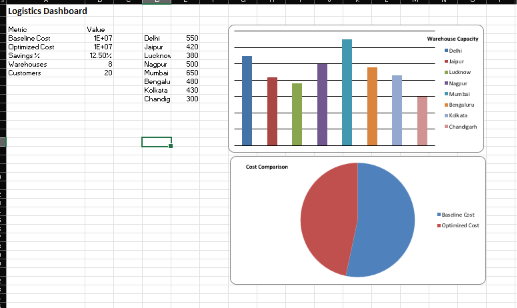
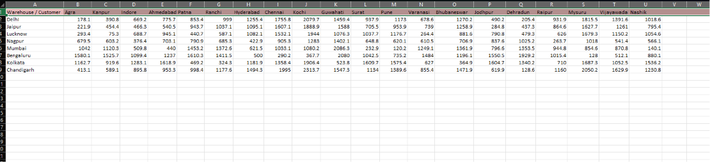

# Transport Optimization Model (Excel + OpenSolver)

## Overview

This project presents a transportation optimization model developed in Microsoft Excel using OpenSolver. The objective is to minimize freight transportation costs while satisfying customer demand and warehouse capacity constraints.

The model uses warehouse and customer location data, Haversine distance calculations, and linear optimization to determine an optimal shipment allocation plan.

---

## Key Features

- Warehouse and customer master dataset
- Haversine distance calculation using latitude and longitude
- Freight cost matrix generation
- Transportation optimization using OpenSolver (CBC)
- Interactive dashboard for logistics analysis

---

## Workbook Structure

| Worksheet | Description |
|-----------|-------------|
| Master_Data | Warehouse and customer information |
| Distance_Matrix | Distance between warehouses and customer locations |
| Cost_Matrix | Transportation cost calculations |
| OpenSolver_Model | Optimization model with decision variables and constraints |
| Dashboard | Summary of key logistics metrics |

---

## Optimization Model

**Objective**

Minimize total transportation cost.

**Decision Variables**

Shipment quantity allocated from each warehouse to each customer.

**Constraints**

- Warehouse capacity must not be exceeded.
- Customer demand must be fully satisfied.
- Shipment quantities are non-negative.

---

## Tools Used

- Microsoft Excel
- OpenSolver (CBC Solver)
- Haversine Formula

---

## Dashboard

---

## Distance Matrix

